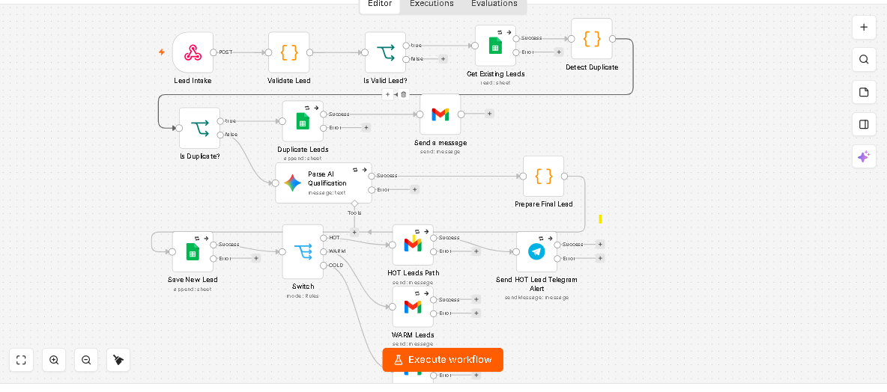

# 🏠 AI Real Estate Lead Qualification System

A lightweight, automated lead capture, validation, duplicate detection, and AI-powered scoring system designed specifically for real estate agencies. 

This project receives incoming property leads (from webhooks, Meta Ads, or web forms), validates contact details, checks for duplicates, scores the lead's buying intent using OpenAI / Gemini models, and syncs the structured output into Google Sheets and CRMs for immediate agent action.

---

## 🎯 The Problem

Real estate sales teams waste up to **60% of their day** calling invalid phone numbers, cold tire-kickers, or duplicate inquiries. High-value leads (HOT buyers) often experience delayed response times, leading to lost deals and high cost-per-acquisition (CPA).

---

## ⚡ The Solution

An end-to-end automated pipeline that processes leads in under 5 seconds:

```
Lead Ingestion (Webhook / Form)
        │
        ▼
Validation & Formatting (Phone, Email, Names)
        │
        ▼
Duplicate Detection (Google Sheets / CRM Check)
        │
        ▼
AI Qualification Engine (Intent, Budget, Timeline Analysis)
        │
        ▼
Lead Scoring (HOT / WARM / COLD)
        │
        ▼
Data Synchronization (Google Sheets / CRM / Sales Alert)
```

---

## ✨ Key Features

- **Multi-Source Ingestion:** Webhook endpoints compatible with Facebook Lead Ads, Elementor Forms, Website Webhooks, and Zapier/Make.
- **Data Hygiene:** Standardizes phone numbers to International/E.164 format and cleans raw user inputs.
- **Smart Duplicate Prevention:** Checks existing records to avoid duplicate agent outreach and spamming leads.
- **AI Intent Scoring:** Analyzes budget, urgency, location preference, and finance readiness to categorize leads into **HOT**, **WARM**, or **COLD**.
- **Instant Alerts:** Logs categorized data straight to Google Sheets / CRM and triggers instant notifications for HOT leads.

---

## 🛠️ Tech Stack & Prerequisites

- **Automation Engine:** [n8n](https://n8n.io/) (Self-hosted or Cloud)
- **AI Model:** OpenAI API (`gpt-4o-mini` / `gpt-4o`) OR Google Gemini API
- **Database / CRM:** Google Sheets API / HubSpot / Custom Webhook
- **Notification:** Meta WhatsApp Cloud API / Email / Slack

---

## 🧠 AI Prompt & Scoring Logic

The AI model receives raw lead inputs and evaluates them based on 4 core parameters:

| Metric | High Priority (HOT) | Medium Priority (WARM) | Low Priority (COLD) |
| :--- | :--- | :--- | :--- |
| **Budget** | Matches or exceeds property price | Flexible / Undecided | Way below market value |
| **Timeline** | Immediate to < 30 Days | 1 - 3 Months | Exploring / > 6 Months |
| **Payment Method**| Cash / Approved Bank Loan | Needs Mortgage Help | Unclear / No Finance |
| **Intent** | Direct site-visit request | General inquiry | Casual browsing |

---

## 🚀 Installation & Setup

### 1. Webhook Setup
1. Deploy the provided n8n workflow JSON file into your n8n instance.
2. Copy the **Production Webhook URL** from the Webhook Trigger node.
3. Paste the URL into your Lead Capture Source (e.g., WordPress Form, Facebook Lead Ads, Meta Webhook).

### 2. Environment Variables
Configure the following credentials in your n8n instance:
- `OPENAI_API_KEY` (or Google Gemini API Key)
- `GOOGLE_SHEETS_OAUTH2`

### 3. Google Sheets Schema
Set up your destination Google Sheet with the following headers:
`Timestamp` | `Full Name` | `Phone` | `Email` | `Location` | `Budget` | `Property Type` | `Lead Category` | `Lead Score (1-10)` | `AI Summary`

---

## 📊 Commercial Pricing Model (For Clients)

| Metric | Cost / Value |
| :--- | :--- |
| **Estimated Monthly Infra Cost:** | Rs. 1,500 – 4,500 PKR ($5 – $15 USD) |
| **Starter Setup Price:** | Rs. 35,000 – 45,000 PKR |
| **Monthly Maintenance Retainer:** | Rs. 10,000 PKR / month |

---


This project serves as **Project #1 (Foundation Layer)** of the complete **Real Estate AI Operating System**.

